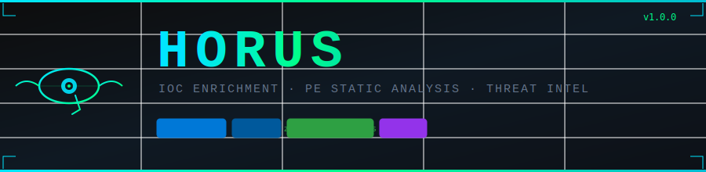

<div align="center">



<br/>


<br/>

```
  _   _  ___  ____  _   _ ____
 | | | |/ _ \|  _ \| | | / ___|
 | |_| | | | | |_) | | | \___ \
 |  _  | |_| |  _ <| |_| |___) |
 |_| |_|\___/|_| \_\\___/|____/

  🔱 the all-seeing eye  —  IOC enrichment & PE static analysis
```

<br/>

**Drop it anywhere. Point it at anything. Get a verdict.**

[**Download horus.exe**](https://github.com/mobinert/HORUS/releases/latest) · [View Source](#architecture) · [Quick Start](#quick-start) · [Usage Guide](#full-usage-guide)

</div>

---

## What is Horus?

Horus is a **single-file Windows security triage tool** — no Python, no installers, no dependencies. It links only against APIs that already ship with Windows (`BCrypt` for hashing, `WinHTTP` for HTTPS) and compiles down to one self-contained `.exe`.

Hand it **anything** and it figures out what to do:

| You give it | What Horus does |
|---|---|
| A file path | Hashes it (MD5/SHA-1/SHA-256), parses the PE if applicable, scores risk, pivots on embedded indicators |
| An MD5, SHA-1, or SHA-256 | Queries VirusTotal, reports detections |
| An IPv4 address | Queries VirusTotal + AbuseIPDB in parallel |
| A domain name | Queries VirusTotal, reports category and reputation |
| A URL | Queries VirusTotal, reports verdicts |
| An email address | Queries VirusTotal |

No flags needed. `horus <thing>` is all it takes.

---

## Terminal Preview

```
  _   _  ___  ____  _   _ ____
 | | | |/ _ \|  _ \| | | / ___|
 | |_| | | | | |_) | | | \___ \
 |  _  | |_| |  _ <| |_| |___) |
 |_| |_|\___/|_| \_\\___/|____/
  🔱 the all-seeing eye  —  IOC enrichment & PE static analysis

$ horus ransomware_sample.exe

FILE ────────────────────────────────────────────────────────────
  path              ransomware_sample.exe
  size              102,912 bytes
  MD5               a3f5d1e2c7b849d60e14a2b8f93c5d17
  SHA-1             4b2e8a91c3d056f7e820b4a19c6d3f7e2b085c40
  SHA-256           e3b0c44298fc1c149afbf4c8996fb924...852b855

PE HEADER ───────────────────────────────────────────────────────
  type              executable
  bitness           64-bit (PE32+)
  machine           x64 (AMD64)
  subsystem         Windows Console
  compiled          2018-11-06 22:28:12 UTC  (suspicious)
  entry RVA         0x12a0
  imphash           9a4f2c8d1e7b3056a82c914d6e0f5b17

SECTIONS ────────────────────────────────────────────────────────
  .text     r-x  H=6.21  [##########........]
  .rdata    r--  H=4.87  [########..........]
  .data     rw-  H=4.12  [#######...........]
  UPX0      rwx  H=7.94  [##################]  RWX!
  UPX1      rwx  H=7.81  [#################.]  RWX!

IMPORTS  (4 DLLs, 11 functions) ─────────────────────────────────
  KERNEL32.DLL  (6)
  ADVAPI32.DLL  (3)
  WS2_32.DLL    (2)

CAPABILITIES ────────────────────────────────────────────────────
  [Cryptography]         encrypts data — benign, or ransomware/payload packing
      CryptAcquireContextA  CryptGenKey  CryptEncrypt

  [Network Activity]     opens sockets or fetches remote content
      WSAStartup  connect

  [Persistence]          writes autostart keys or installs itself to survive reboot
      RegSetValueExA  RegCreateKeyExA

  ! Encryption combined with network I/O (exfil / ransomware pattern)  +12
  ! High-entropy section 'UPX0' (H=7.94) — likely packed/encrypted     +12
  ! Section 'UPX0' is writable AND executable (RWX)                     +18
  ! Section 'UPX1' is writable AND executable (RWX)                     +18
  ! Known packer section name 'UPX0'                                    +16

EMBEDDED INDICATORS  (from strings) ────────────────────────────
  url    http://185.220.101.5:8080/gate.php
  ip     185.220.101.5
  tokens  cmd.exe  schtasks  powershell

VIRUSTOTAL ──────────────────────────────────────────────────────
  VirusTotal  61/72 — Ransom.FileCryptor.Generic (Malicious)

VERDICT ─────────────────────────────────────────────────────────
  [ LIKELY MALICIOUS ]   risk 98/100
  static analysis: LIKELY MALICIOUS (86)
  virustotal: 61/72 engines
```

---

## How the Risk Score Works

Horus doesn't just list imports — it interprets them. The scoring engine maps ~110 Windows APIs to the capabilities they imply, then weights the **combinations** that matter:

### Individual Capabilities

| Capability | What it means | Score |
|---|---|---|
| Process Injection | `VirtualAllocEx`, `WriteProcessMemory`, `CreateRemoteThread` | **+22** |
| Input Capture (Keylogger) | `SetWindowsHookEx`, `GetAsyncKeyState`, `RegisterRawInputDevices` | **+20** |
| Persistence | `RegSetValueEx`, `CreateService` | **+14** |
| Privilege Escalation | `AdjustTokenPrivileges`, `DuplicateTokenEx`, `ImpersonateLoggedOnUser` | **+14** |
| Screen Capture | `BitBlt`, `GetDC`, `CreateCompatibleBitmap` | **+12** |
| Defense Evasion | `DeleteFile`, `SetFileAttributes`, `EventWrite` | **+12** |
| Networking | Winsock + WinHTTP + WinInet | **+8** |
| Cryptography | `CryptEncrypt`, `BCryptEncrypt`, `CryptGenKey` | **+8** |
| RWX Section | Writable **and** executable section | **+18 each** |
| High-entropy section | Shannon entropy ≥ 7.2 bits (packed/encrypted) | **+12 each** |
| Known packer name | UPX, Themida, VMProtect, .enigma, .vmp… | **+16** |

### Combination Bonuses (the important part)

| Combination | Why it matters | Bonus |
|---|---|---|
| **Injection + API resolution** | Hiding injected code behind dynamic imports | **+15** |
| **Keylogger + networking** | Classic keylogger-and-exfil architecture | **+15** |
| **Crypto + networking** | Ransomware or C2 exfiltration pattern | **+12** |

Common dual-use APIs (`LoadLibrary`, `CreateProcess`, `GetProcAddress`) are shown but **don't add to the score alone** — they show up in ordinary binaries all the time. Only rare primitives and dangerous combinations move the needle.

### Verdict Bands

| Score | Verdict | Meaning |
|---|---|---|
| 0–9 | **CLEAN** | Nothing concerning found |
| 10–29 | **LOW RISK** | Suspicious imports but no strong signals |
| 30–59 | **SUSPICIOUS** | Multiple concerning capabilities or combos |
| 60–100 | **LIKELY MALICIOUS** | Strong evidence of malicious intent |

---

## Quick Start

### 1. Download (no install needed)

Grab `horus.exe` from [**Releases**](https://github.com/mobinert/HORUS/releases/latest) and put it somewhere on your PATH — or just run it from any folder.

```powershell
# Run from wherever you downloaded it
.\horus.exe suspicious.exe
```

### 2. Set API Keys (optional but recommended)

Horus works without keys — it still does full static PE analysis and hashing. Keys unlock the live threat-intel lookups.

```powershell
# Set for this session
$env:VT_API_KEY        = "your_virustotal_key"
$env:ABUSEIPDB_API_KEY = "your_abuseipdb_key"

# Or make them permanent (user profile)
[System.Environment]::SetEnvironmentVariable("VT_API_KEY","your_key","User")
[System.Environment]::SetEnvironmentVariable("ABUSEIPDB_API_KEY","your_key","User")
```

Free API keys:
- **VirusTotal** → [virustotal.com](https://www.virustotal.com) → Sign in → API Key
- **AbuseIPDB** → [abuseipdb.com](https://www.abuseipdb.com) → Account → API

---

## Full Usage Guide

```
horus <indicator-or-file> [options]

  <indicator-or-file>   anything: a file path, hash, IP, domain, URL, or email

options:
  --vt-key    <key>     VirusTotal API key      (overrides VT_API_KEY env)
  --abuse-key <key>     AbuseIPDB API key        (overrides ABUSEIPDB_API_KEY env)
  --strings             dump extracted ASCII/UTF-16 strings from the file
  --json                machine-readable JSON output (exit code 1 = suspicious/malicious)
  --no-color            disable ANSI colour (auto-disabled when piped)
  -h, --help            show this help
```

### File Analysis Examples

```bat
:: Static analysis of a suspicious binary (PE parser + entropy + capabilities)
horus C:\Samples\malware.exe

:: Same, plus VirusTotal file reputation by SHA-256
horus C:\Samples\malware.exe --vt-key %VT_API_KEY%

:: Analyze and dump its full string table
horus C:\Samples\dropper.dll --strings

:: Get machine-readable JSON for scripting or SIEM ingestion
horus C:\Samples\payload.bin --json

:: Pipe JSON output into jq to extract just the verdict
horus suspicious.exe --json | jq .verdict
```

### IOC Lookup Examples

```bat
:: MD5, SHA-1, or SHA-256 hash — Horus auto-detects the type
horus 44d88612fea8a8f36de82e1278abb02f
horus 3395856ce81f2b7382dee72602f798b642f14d0
horus 275a021bbfb6489e54d471899f7db9d1663fc695b2cfad87ef3ef...

:: IP reputation from VirusTotal + AbuseIPDB simultaneously
horus 185.220.101.5

:: Domain reputation
horus evil-c2-domain.ru

:: Full URL
horus https://sketchy.example/drop.bin

:: Email address
horus attacker@phishing-domain.com

:: Combine keys inline instead of via env vars
horus 1.2.3.4 --vt-key abc123 --abuse-key def456

:: JSON output for automation
horus 185.220.101.5 --json
```

### Scripting / Automation

Exit codes make Horus useful in pipelines:

| Exit code | Meaning |
|---|---|
| `0` | Clean / unknown — nothing suspicious found |
| `1` | Suspicious or malicious — score ≥ 30 |
| `2` | Usage error or file not found |

```powershell
# Block a file from being used if Horus flags it
horus .\download.exe --json | Out-Null
if ($LASTEXITCODE -eq 1) {
    Write-Warning "File flagged — not running it."
    exit 1
}

# Batch-triage a folder
Get-ChildItem C:\Quarantine\*.exe | ForEach-Object {
    $result = horus $_.FullName --json | ConvertFrom-Json
    "$($_.Name): $($result.verdict) (score $($result.final_score))"
}
```

### JSON Output Format

```json
{
  "target":       "malware.exe",
  "size":          102912,
  "md5":          "a3f5d1e2c7b849d60e14a2b8f93c5d17",
  "sha1":         "4b2e8a91c3d056f7e820b4a19c6d3f7e2b085c40",
  "sha256":       "e3b0c44298fc1c149afbf4c8996fb92427ae41e4649b934ca495991b7852b855",
  "is_pe":         true,
  "bitness":       64,
  "imphash":      "9a4f2c8d1e7b3056a82c914d6e0f5b17",
  "static_score":  86,
  "vt_detections": 61,
  "final_score":   98,
  "verdict":      "LIKELY MALICIOUS"
}
```

---

## Architecture

No external libraries. No runtime dependencies. Everything in one `.exe`.

```
horus/
│
├── src/
│   ├── main.cpp          CLI entry point + orchestration + report rendering
│   ├── pe.hpp            PE32 / PE32+ parser — every field bounds-checked
│   ├── signatures.hpp    110-API knowledge base + capability scoring engine
│   ├── ioc.hpp           indicator type auto-detection (no regex, hand-rolled)
│   ├── json.hpp          zero-dependency JSON parser (recursive descent)
│   ├── crypto.cpp/hpp    MD5 / SHA-1 / SHA-256 via Windows BCrypt/CNG
│   ├── http.cpp/hpp      HTTPS client via Windows WinHTTP
│   ├── intel.cpp/hpp     VirusTotal v3 + AbuseIPDB v2 (extensible interface)
│   └── console.hpp       ANSI colour / formatted terminal output
│
├── tests/
│   ├── test_ioc.cpp      indicator classifier unit tests
│   ├── test_json.cpp     JSON parser unit tests
│   ├── test_pe.cpp       PE parser unit tests
│   └── test_score.cpp    risk scoring engine unit tests
│
├── CMakeLists.txt        CMake build (MSVC or MinGW-w64)
└── LICENSE
```

### Internal Data Flow

```
horus <argument>
       │
       ├─ file_exists(arg)? ──YES──► analyze_file()
       │                                │
       │                                ├─ read bytes
       │                                ├─ hash_buffer()   ← BCrypt/CNG
       │                                ├─ pe::Analyzer::analyze()
       │                                │     ├─ parse headers (bounds-checked)
       │                                │     ├─ parse sections + entropy
       │                                │     ├─ parse import table
       │                                │     └─ build imphash string
       │                                ├─ sig::score()    ← capability engine
       │                                ├─ extract_strings() → scan_strings()
       │                                └─ VirusTotal lookup (if key set)
       │
       └─ NO ──► classify(arg)
                     │
                     └─► intel::enrich()  ← parallel fan-out
                               ├─ VirusTotal::lookup()   (if supported + key)
                               └─ AbuseIPDB::lookup()    (if supported + key)
```

### Adding a New Intel Source

The `IntelSource` interface is three methods. One new file, one new line in `build_sources()`:

```cpp
// In intel.cpp — add this class
class URLhaus : public IntelSource {
public:
    explicit URLhaus(std::string key) : key_(std::move(key)) {}
    std::string name() const override { return "URLhaus"; }
    bool supports(IocType t) const override {
        return t == IocType::Url || t == IocType::Domain;
    }
    SourceResult lookup(const std::string& ioc, IocType) const override {
        // one WinHTTP call → parse JSON → fill SourceResult
    }
private:
    std::string key_;
};

// In main.cpp — build_sources(), add one line:
if (!o.urlhaus_key.empty()) v.push_back(std::make_shared<URLhaus>(o.urlhaus_key));
```

Candidate sources to add: URLhaus · OTX (AlienVault) · GreyNoise · Shodan · MalwareBazaar

---

## Building from Source

**Requirements:** Windows, Visual Studio 2019 or later (free Community edition works)

### Option A — MSVC Developer Command Prompt

Open **"x64 Native Tools Command Prompt for VS 2022"** (or 2019), then:

```bat
git clone https://github.com/mobinert/HORUS.git
cd HORUS
cl /EHsc /std:c++17 /O2 /DNOMINMAX /DWIN32_LEAN_AND_MEAN /D_WIN32_WINNT=0x0601 ^
   src\main.cpp src\crypto.cpp src\http.cpp src\intel.cpp ^
   /I src /Fe:horus.exe bcrypt.lib winhttp.lib
```

### Option B — CMake

```bat
git clone https://github.com/mobinert/HORUS.git
cd HORUS
cmake -B build -G "Visual Studio 17 2022"
cmake --build build --config Release
:: binary at build\Release\horus.exe
```

### Option C — MinGW-w64 (MSYS2)

```bash
pacman -S mingw-w64-x86_64-gcc mingw-w64-x86_64-cmake
cmake -B build -G "MinGW Makefiles"
cmake --build build
```

---

## Imphash

The imphash follows the Mandiant recipe: lowercase `dll.function` pairs (with extension stripped for `.dll`, `.ocx`, `.sys`), joined by commas in import order, then MD5'd. This matches what tools like `pefile` and `pe-sieve` produce, so you can cross-reference Horus results with existing malware family databases.

---

## Safety and Limitations

- Horus is **read-only** — it never executes, modifies, or generates anything.
- The PE parser **bounds-checks every offset and length** before reading. Feeding it a malformed or malicious sample is safe.
- The static risk score is a **triage aid**, not a production verdict. Pair it with VirusTotal consensus and, for anything that matters, a sandbox detonation.
- Obfuscated samples that load all their imports at runtime will score low on static analysis — that's expected. The entropy and packing heuristics partially compensate, but there's no substitute for dynamic analysis on heavily obfuscated code.

---

## License

MIT — see [LICENSE](LICENSE). Free for personal, commercial, and research use forever.

---

<div align="center">


**Built for defenders. Free forever. No strings attached.**

⭐ If Horus helped you, a star goes a long way

</div>
